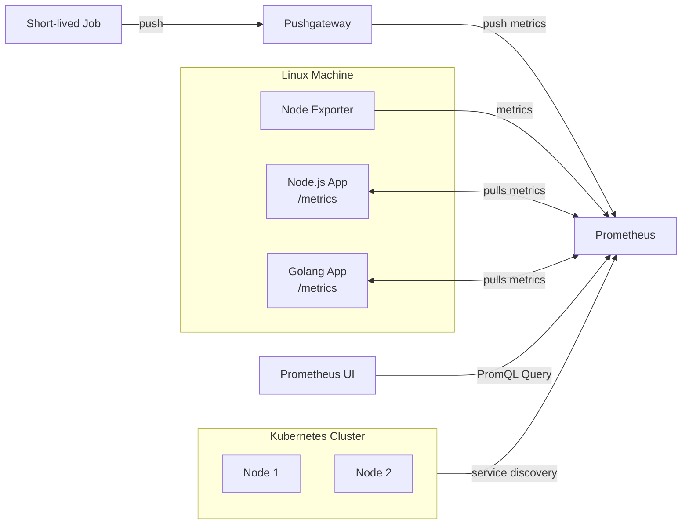

```mermaid
flowchart LR

    Job["Short-lived Job"]
    Push["Pushgateway"]

    Job -->|push| Push

    subgraph Linux["Linux Machine"]
        NodeExporter["Node Exporter"]

        NodeApp["Node.js App
        /metrics"]

        GoApp["Golang App
        /metrics"]
    end

    subgraph K8s["Kubernetes Cluster"]
        Node1["Node 1"]
        Node2["Node 2"]
    end

    Prometheus["Prometheus"]

    UI["Prometheus UI"]

    Push -->|push metrics| Prometheus

    NodeExporter -->|metrics| Prometheus

    NodeApp <-->|pulls metrics| Prometheus

    GoApp <-->|pulls metrics| Prometheus

    K8s -->|service discovery| Prometheus

    UI -->|PromQL Query| Prometheus
```
