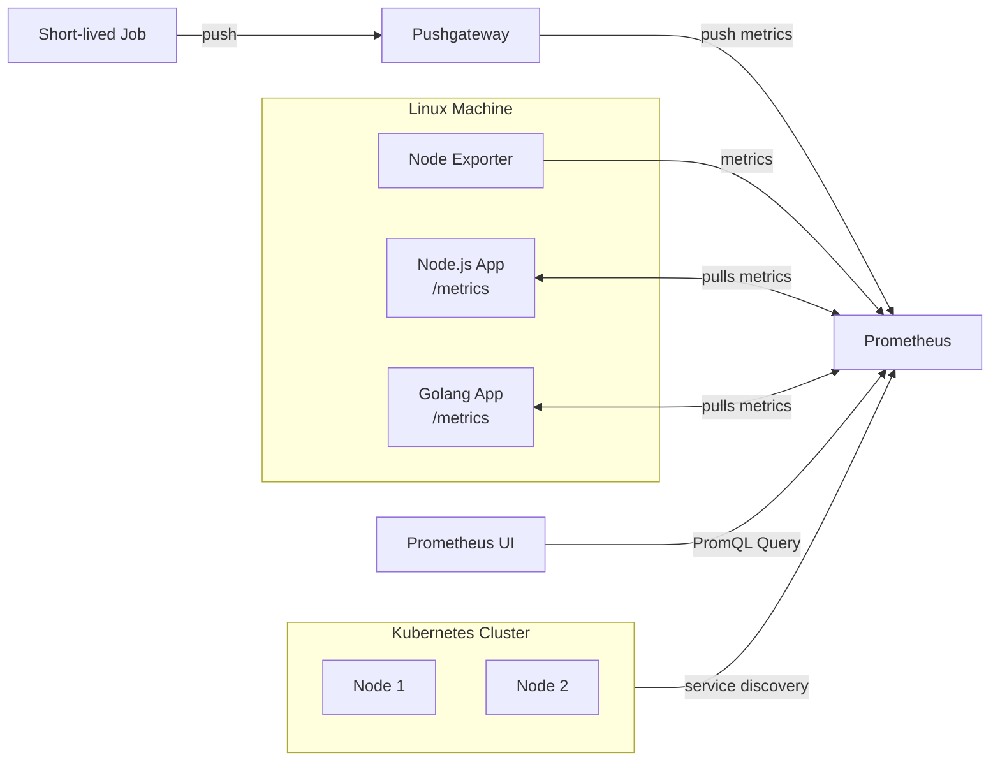

# Prometheus

Prometheus is an open-source monitoring and alerting toolkit used to collect, store, and query application metrics. It periodically scrapes metrics exposed by applications and stores them as time-series data.

## Why Use Prometheus?

- Monitor application health
- Track system and business metrics
- Create dashboards using Grafana
- Configure alerts for failures and abnormal behavior
- Analyze application performance over time

## Exporting Metrics in Node.js

Install the `prom-client` package to expose metrics from your application.

```bash
npm install prom-client
```

`prom-client` provides an easy way to create and expose custom metrics that Prometheus can scrape.

## Types of Metrics

### 1. Counter

A **Counter** is a metric that only increases (or resets to zero when the application restarts).

**Use Cases**
- Total HTTP requests
- Total logins
- Number of errors
- Messages processed

```javascript
const client = require("prom-client");

const requestCounter = new client.Counter({
    name: "http_requests_total",
    help: "Total number of HTTP requests"
});

requestCounter.inc();      // +1
requestCounter.inc(5);     // +5
```

---

### 2. Gauge

A **Gauge** represents a value that can increase or decrease.

**Use Cases**
- Active users
- Memory usage
- CPU utilization
- Queue length

```javascript
const activeUsers = new client.Gauge({
    name: "active_users",
    help: "Current active users"
});

activeUsers.set(25);
activeUsers.inc();
activeUsers.dec();
```

---

### 3. Histogram

A **Histogram** measures the distribution of values by grouping observations into buckets.

**Use Cases**
- API response time
- Database query latency
- Request size
- File upload duration

```javascript
const responseTime = new client.Histogram({
    name: "http_request_duration_seconds",
    help: "HTTP request duration",
    buckets: [0.1, 0.5, 1, 2, 5]
});

const end = responseTime.startTimer();

// Execute request...

end();
```

# Prometheus Setup

## 1. Create `prometheus.yml`

```yaml
global:
  scrape_interval: 15s

  external_labels:
    monitor: "codelab-monitor"

scrape_configs:
  - job_name: "monitor-app"

    static_configs:
      - targets: ["localhost:3000"]
```

---

## 2. Run Prometheus

```bash
docker run -d \
  --name prometheus \
  -p 9090:9090 \
  -v ./prometheus.yml:/etc/prometheus/prometheus.yml \
  prom/prometheus
```

At this point, Prometheus will **not** be able to scrape your application if it is running on your host machine (`localhost:3000`).

Inside a Docker container, `localhost` refers to the container itself, **not your computer**.

---

## 3. Containerize the Application

Build the Docker image:

```bash
docker build -t monitor-app .
```

---

## 4. Create a Docker Network

Create a shared network so both containers can communicate.

```bash
docker network create prom-network
```

---

## 5. Run the Application Container

```bash
docker run -d \
  --name node-app \
  --network prom-network \
  -p 3000:3000 \
  monitor-app
```

---

## 6. Update `prometheus.yml`

Since both containers are on the same Docker network, Prometheus should scrape the application using its **container name** instead of `localhost`.

```yaml
global:
  scrape_interval: 15s

  external_labels:
    monitor: "codelab-monitor"

scrape_configs:
  - job_name: "monitor-app"

    static_configs:
      - targets: ["node-app:3000"]
```

---

## 7. Run Prometheus on the Same Network

```bash
docker run -d \
  --name prometheus \
  --network prom-network \
  -p 9090:9090 \
  -v ./prometheus.yml:/etc/prometheus/prometheus.yml \
  prom/prometheus
```

Now Prometheus can successfully scrape metrics from the application.

---

## 8. Verify

Open Prometheus in your browser:

```
http://localhost:9090
```

Navigate to **Status → Targets** to verify that the `monitor-app` target is **UP**.

---

## Alternative: Docker Compose

Instead of creating a Docker network and running multiple Docker commands manually, you can use **Docker Compose** to build and start both the Node.js application and Prometheus with a single command.

### Create `docker-compose.yml`

```yaml
services:
  node-app:
    build:
      context: .
    ports:
      - "3000:3000"

  prometheus:
    image: prom/prometheus
    ports:
      - "9090:9090"
    volumes:
      - ./prometheus.yml:/etc/prometheus/prometheus.yml
    depends_on:
      - node-app
```

> **Note:** Docker Compose automatically creates a network and connects both services to it. No manual network creation is required.

The service name (`node-app`) acts as the hostname that Prometheus uses to communicate with your application.

### Start the Services

Build the application image and start all services in detached mode:

```bash
docker compose up --build -d
```

### Verify

Open the following URLs in your browser:

* **Application:** `http://localhost:3000`
* **Prometheus:** `http://localhost:9090`

Go to **Status → Targets** in Prometheus and verify that the `monitor-app` target is **UP**.

### Stop the Services

```bash
docker compose down
```


## Common PromQL Queries

| Query | Description |
|-------|-------------|
| `metric_name` | Current value of a metric |
| `metric_name[5m]` | Metric values from the last 5 minutes |
| `sum(metric)` | Sum of all matching series |
| `avg(metric)` | Average value |
| `min(metric)` | Minimum value |
| `max(metric)` | Maximum value |
| `count(metric)` | Count matching series |
| `rate(metric[5m])` | Per-second average rate (Counters) |
| `irate(metric[5m])` | Instantaneous rate |
| `increase(metric[1h])` | Total increase over time |
| `topk(5, metric)` | Top 5 series by value |
| `bottomk(5, metric)` | Bottom 5 series by value |
| `sum by(label)(metric)` | Group and sum by label |
| `sum without(label)(metric)` | Sum while ignoring a label |
| `metric{label="value"}` | Filter by label |
| `metric{label=~"A|B"}` | Regex label filter |
| `histogram_quantile(0.95, sum(rate(metric_bucket[5m])) by (le))` | 95th percentile latency |